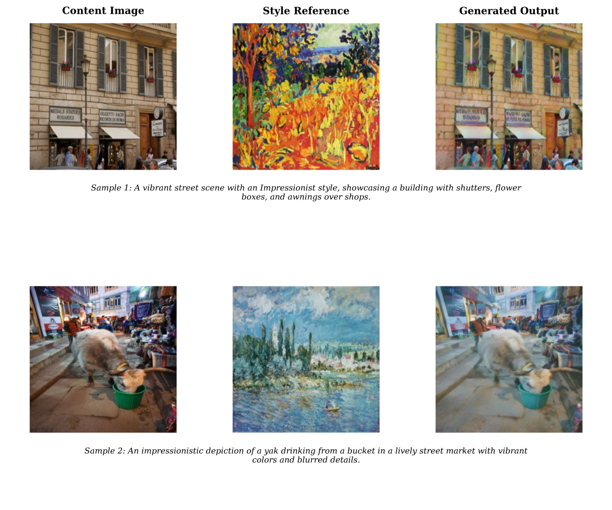
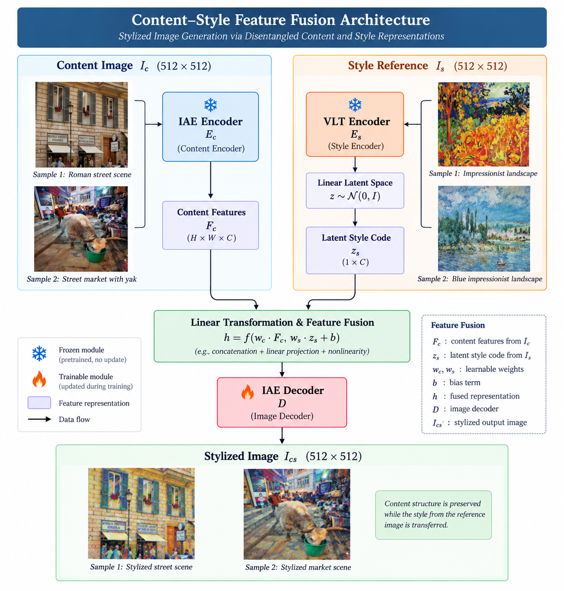
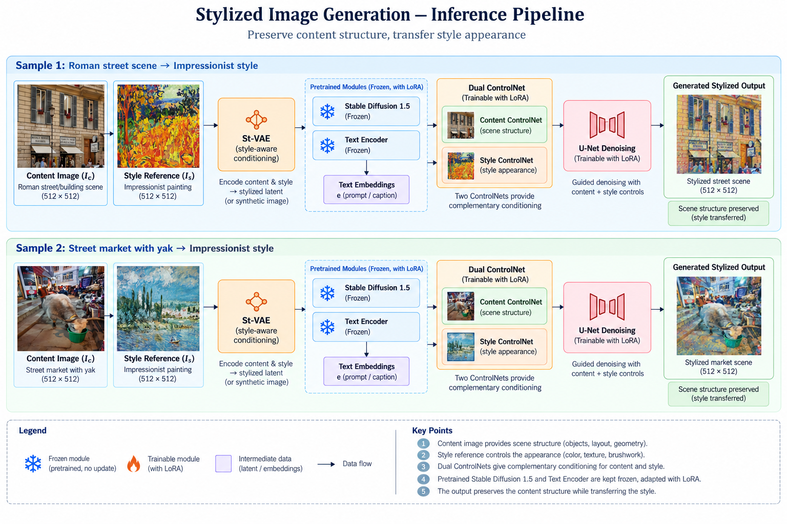
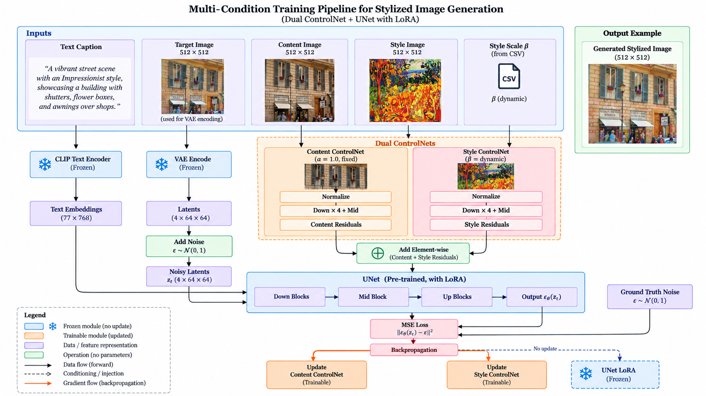

# HC-SCDNet

**Hybrid Content-Style Controllable Diffusion Network**, a project that teaches Stable Diffusion to restyle images that are full of text and structure, like documents, street signage, and forms, without turning the text into mush.


<p align="center">
  
</p>

## The problem we're poking at

Most neural style transfer work, and most diffusion based style transfer, is tuned on generic photos: landscapes, portraits, objects. Apply the same techniques to a photo of a shopfront with signage, a scanned form, or anything where *legible structure* matters, and things fall apart fast. Text warps into abstract shapes, layouts drift, and fine edges dissolve into brushstrokes. Global stylization has no notion of "stylize the wall, not the words on it."

HC-SCDNet gives a diffusion model two separate steering wheels. One for **what stays structurally intact** (edges, glyphs, layout), and one for **how aggressively style gets painted on top**, instead of one blunt style strength knob.

## How it works

The pipeline runs in two phases. First we manufacture a training set, since no paired content/style/target dataset exists off the shelf. Then we fine tune Stable Diffusion 1.5 on it with a dual ControlNet setup.

### Phase 1: build a synthetic triplet dataset

There's no ground truth for "this photo, but painted like that painting," so we generate our own targets using a modified **ST-VAE** ([Liu et al., "Multiple Style Transfer via Variational Autoencoder"](https://arxiv.org/abs/2110.07375)), with one addition: an **α blend parameter** injected into the fusion step.

<p align="center">
  
</p>

The original ST-VAE just adds the content and style latents together. We fuse them with a learnable, controllable scalar instead:

```
z_fused = (1 − α) · z_content + α · z_style      # α ∈ [0, 1]
```

At α = 0 you get the content image back untouched. At α = 1 you get a fully stylized (and likely illegible) image. Sweeping α during dataset generation gives us a curriculum from subtle to heavy stylization, which turned out to matter a lot for downstream training stability.

- **Content images**: [RVL-CDIP](https://www.cs.cmu.edu/~aharley/rvl-cdip/) and [DocVQA](https://www.docvqa.org/) style document scenes, plus COCO
- **Style images**: [WikiArt](https://www.wikiart.org/), around 80,000 paintings
- **Captions**: every synthetic target is auto captioned with **Llama 3.2 11B Vision Instruct**, describing content, style, and how the two interact. This becomes the text conditioning for training.
- **Scale**: about 70,000 triplets total (57k train, 3k eval, 10k held out test)

### Phase 2: fine tune Stable Diffusion with dual ControlNets

This is the actual novelty. Instead of one ControlNet doing double duty, we run **two**, each locked to its own job:

- **Content ControlNet**, conditioned on Canny edges, HED boundaries, and glyph contours of the source image. Its weight (λ_c) is pinned high and fixed, so structure preservation isn't something the model can trade away for a better looking style.
- **Style ControlNet**, conditioned on style feature maps, texture residuals, and colour embeddings from the reference painting. Its weight (λ_s) is loaded dynamically per sample, so style intensity can vary across the dataset.

```
h' = h_UNet + λ_c · h_content + λ_s · h_style        (λ_c > λ_s, by design)
```

The base UNet is adapted with **LoRA** (rank 16, α = 32) rather than full fine tuning, mainly to avoid catastrophic forgetting of SD1.5's general priors and to keep the whole thing trainable on a single GPU.

At inference, the same two samples run through ST-VAE conditioning, the dual ControlNet, and LoRA-adapted denoising to produce the stylized output:

<p align="center">
  
</p>

<details>
<summary>Full training time data flow (click to expand)</summary>
<p align="center">
  
</p>
</details>

## Repo layout

The repo carries two generations of the project, which is worth knowing so the folders make sense.

```
gan-HC-SCDNet/
├── b-vae/                    # Early β-VAE disentanglement experiment (style/content
│                              #   latent split), the first approach we tried, later
│                              #   superseded by the ST-VAE + dual ControlNet design below
├── st-vae-style-decoding/    # α-modulated ST-VAE, generates the synthetic triplet dataset
├── vlm-caption/               # Llama 3.2 Vision captioning of the synthetic dataset
├── ControlNet/                # Dual ControlNet model definition and training entry point
├── SDFinetune/                # LoRA / ControlNet fine tuning scripts for SD 1.5, 2.1, 3.5
├── ccds-files/                # SLURM job scripts and logs for NTU's compute cluster (CCDS)
├── existing-pretrained/       # Sanity check scripts: does the pipeline run before training?
├── src/                       # Original architecture sketch (β-VAE + custom lightweight
│                              #   diffusion U-Net + PatchGAN refinement), an early design
│                              #   scaffold, not the pipeline that produced the results
│                              #   below, kept for reference
└── architecture_diagram.png   # Diagram for that same early src/ design
```

If you're here for the thing described in the report, the path through the code is `st-vae-style-decoding/`, then `vlm-caption/`, then `SDFinetune/` (or `ControlNet/`), then `ccds-files/scripts/` to run it on a SLURM cluster. `b-vae/` and `src/` are earlier exploration kept around rather than deleted, since they document how the design evolved.

## Running it

This was built and trained on NTU's CCDS SLURM cluster with A100 GPUs, so a few paths in the scripts are cluster specific. Expect to adjust `DATASET_ROOT`, output paths, and SLURM directives for your own environment.

**1. Get the base datasets**

```bash
python b-vae/data/scripts/download_wiki_art.py
python b-vae/data/scripts/download-coco-gdrive.py
python b-vae/data/scripts/split_dataset.py
```

**2. Generate the synthetic triplet dataset** (content and style go in, an α blended target comes out)

```bash
cd st-vae-style-decoding
python decode-style-image.py          # about 60k training triplets
python gen-test-images.py             # held out test set
```

**3. Caption the synthetic targets**

```bash
cd vlm-caption
python gen_caption_llama.py           # or caption_dataset_batched.py for large batches
```

**4. Fine-tune Stable Diffusion**

```bash
cd SDFinetune
python train_sd15_controlnet.py       # SD 1.5 + dual ControlNet + LoRA, the paper's config
# also available: train_sd15_lora.py, train_sd25_controlnet.py, train_sd35_lora.py
```

Or on the cluster:

```bash
sbatch ccds-files/scripts/finetune-sd.sh
```

**5. Sanity check before committing to a full training run**

`existing-pretrained/TESTING_GUIDE.md` walks through loading the pretrained SD components and checking that controllability actually works end to end. Worth doing before spending hours on a training run that turns out to be broken.

Dependencies are split across `src/requirements.txt` (core diffusers/torch stack) and `ccds-files/requirement.txt` (exact versions pinned for the cluster environment).

## Does it work?

Table III from the report, comparing the ST-VAE teacher (the thing that generated the training targets) against HC-SCDNet's dual ControlNet output, α = 1.0:

| Metric | ST-VAE | HC-SCDNet (Dual-CN) | Better is |
|---|---|---|---|
| ArtFID ↓ | 35.27 | **36.77** | lower |
| FID ↓ | 22.62 | **22.36** | lower |
| LPIPS ↓ | **0.493** | 0.574 | lower |
| LPIPS (gray) ↓ | **0.396** | 0.412 | lower |
| CFSD ↓ | **0.175** | 0.191 | lower |
| Color distance ↓ | **0.320** | 0.538 | lower |

Read honestly: HC-SCDNet edges out FID (closer to real image statistics, so more realistic outputs) but loses on the perceptual and structural metrics, and applies a noticeably stronger, more aggressive color and style transformation than its own teacher. That's the trade off you'd expect from a model that's actively pushing harder on style than the thing it was trained to imitate, not a free lunch. Text glyph shapes, paragraph spacing, and layout stayed largely intact in qualitative checks despite the stronger stylization, which is the specific thing the dual ControlNet split was meant to buy us.

The caveat that matters most: this was trained for a handful of epochs under a hard compute and time budget, with almost no hyperparameter sweeping. The report is upfront that longer training and tuning λ_s, LoRA rank, and the conditioning schedule would likely move all of these numbers. The current results show the architecture behaves sensibly, not that it's finished.

## What we think is actually new here

Everything else in this pipeline (ST-VAE, LoRA, ControlNet style conditioning) is standard machinery. Two pieces aren't:

1. **α-modulated ST-VAE decoding**: turning a fixed content and style fusion into a continuous, controllable blend, used to generate a *curriculum* of stylization strengths for training data rather than one fixed intensity per image.
2. **Dual, asymmetric ControlNet conditioning**: one branch locked to structural fidelity, one branch free to vary style intensity per sample, so the model has an explicit dial for "how much style" instead of style strength being entangled with everything else the prompt is doing.

## What's next

From the report's future work section, roughly in order of expected payoff: more epochs and a real hyperparameter sweep (adaptive λ_s scheduling, higher LoRA ranks), a more diverse dataset (more content domains, more styles), incorporating vector level structure (glyph contours, layout graphs) for even stronger preservation, and eventually extending this to video and temporal consistency.

## References

Built on top of Stable Diffusion and Latent Diffusion Models (Rombach et al., 2022), ControlNet (Zhang et al., 2023), LoRA (Hu et al., 2021), ST-VAE (Liu et al., 2021), ArtFID (Wright & Ommer, 2022), LPIPS (Zhang et al., 2018), Llama 3.2 Vision Instruct for captioning, and WikiArt and COCO for training data.
